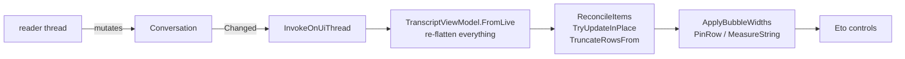
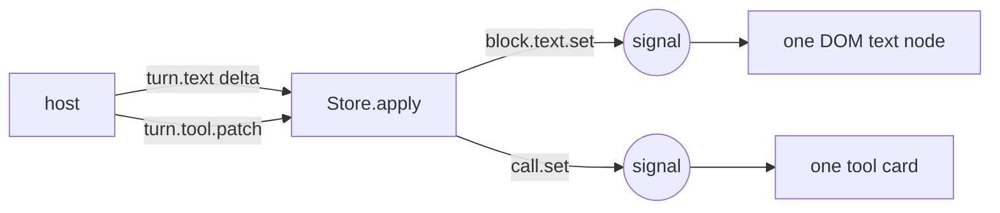

# Rhino AI panel, in TypeScript

A re-imagining of `rhino/plugin/UI/AIPanel.cs` as a webview-hosted web app. Zero runtime dependencies: no framework, no CSS library, no markdown or highlighting package. Two dev dependencies (esbuild, typescript) and an optional one for the browser checks.

It runs today against a scripted mock host, so the whole thing is clickable in a browser without Rhino.

```sh
npm install
npm run build        # dist/panel.{js,css}, dist/panel.html (self-contained), dist/artifact.html
npm run dev          # watching dev server on :5173
npm test             # unit tests for the pure layers (node --test)
npm run verify       # 36 black-box checks in a real browser
```

Open `dist/panel.html`. Under the mock host it wraps itself in review chrome: width presets (264 / 340 / 460 / full), a drag handle, and a light/dark switch, so a docked-panel width can actually be judged. That chrome never appears when a native host is present.

## The one change everything else follows from

The Eto panel subscribed to `Conversation.Changed`, re-read the whole conversation graph, flattened it into rows, and diffed those rows against what it had already drawn:



Here the host says what changed, and a signal sits on the individual text block:



`turn.text` names the block it extends. `turn.tool.patch` names the call it completes. A full `conversation` snapshot exists only for load, resume and reconnect. Nothing re-flattens, nothing re-diffs, no row is rebuilt, no width is measured.

## Layout

```
src/
  core/       signal.ts      ~90 lines of signals: signal / computed / effect / untrack
              dom.ts         declarative elements, scoped effects, keyed list reconciler
              markdown.ts    markdown -> DOM (never an HTML string, so model text cannot inject)
              highlight.ts   tokenizer for python / c# / js / json
  protocol/   events.ts      the panel <-> host wire protocol, one discriminated union each way
              bridge.ts      WebView2 | WKWebView | mock, behind one interface
              mockHost.ts    scripted Rhino: five scenarios, real event ordering
              viewport.ts    a fake viewport capture as an SVG data URI
  state/      store.ts       host state as signals, down to the streaming text block
              ui.ts          view-only state (draft, overlays, expanded cards, scroll pin)
              format.ts      time / tokens / cost / duration / bytes
              tools.ts       tool name -> family -> icon
  ui/         app header transcript message toolCard previews question composer
              history empty notices agentMenu icons context
  dev/        frame.ts       review chrome, mock host only
  styles/     panel.css      design tokens, light + dark, container queries
tools/        verify.mjs     black-box browser checks
```

## What this deletes

| `AIPanel.cs` and friends | Why it is gone |
| --- | --- |
| `TranscriptViewModel` (153 lines) | The host emits blocks directly; there is nothing to flatten. |
| `ReconcileItems` / `TryUpdateInPlace` / `TruncateRowsFrom` / `RenderedRow` | One generic keyed `each` in `dom.ts`. |
| `MessageBubble` (138 lines) | CSS. No `OnPaint`, no hand-drawn rounded rectangle. |
| `TextMeasure`, `ApplyBubbleWidths`, `PinRow`, `LastBudget`, `ScrollbarGuard` | The browser wraps text. `scrollbar-gutter: stable` reserves the gutter. |
| `MessageMeta` height reservation | `opacity` on hover reserves nothing and reflows nothing. |
| `LoadIcon` / `IconCache` / `HexColor` / SVG recolouring | Inline SVG stroked in `currentColor`. |
| `ScrollToBottom` + `AsyncInvoke` retry | A `ResizeObserver` on the content, which is the actual signal. |
| `Populating` re-entrancy guard | State flows one way; the view has no writeback to suppress. |
| `ToolSummary`'s per-tool switch (197 lines) | Phrasing is authored host-side where the real arguments live. |
| `Reconcilable`, `QuestionRow` slot bookkeeping | Regions own their own stretch of DOM. |

Roughly 900 of the 1,474 lines in `AIPanel.cs` exist only to work around Eto.

The totals are not smaller, and it would be dishonest to imply they are. `rhino/plugin/UI` is 3,073 lines of C#; this is ~3,160 lines of TypeScript plus 1,075 of CSS. But ~910 of that TypeScript is `src/core`: a signals runtime, a DOM layer, a markdown renderer and a syntax highlighter, none of which has a C# counterpart because Eto could not have used one. Comparing like with like, the panel logic itself (`src/ui` + `src/state`, 1,964 lines) replaces `AIPanel.cs` + `MessageBubble` + `MessageMeta` + `TextMeasure` + `TranscriptViewModel` + `ToolSummary` (2,158 lines) while doing considerably more.

## What it does that the Eto panel cannot

- **Markdown with highlighted code.** Headings, lists, tables, blockquotes, inline code, and fenced code with a language label and a copy button. The old panel put raw text in a `Label`.
- **Tool results rendered as the thing they are.** A capture shows the image inline without a click. A layer listing shows a table. A selection shows a clickable object list that reveals in the viewport. A solve shows component and diagnostic chips. Raw JSON is still one click away, syntax-highlighted.
- **`@` context.** Mention the selection, a layer, the active view, the document or the open Grasshopper file, and it rides along with the prompt as a chip. This is the affordance a CAD agent most obviously wants and Eto made awkward.
- **`/` commands** in the composer: new, history, agent, stop, settings.
- **Per-turn revert.** `TurnUndoCheckpoint` already makes a turn one undo record; the turn footer now exposes it.
- **A plan strip** for agents that emit one.
- **Searchable history** as a drawer, instead of a dropdown of truncated labels.
- **Agent switching** that shows *why* an agent is unavailable rather than appending `(not found)` to a name Eto cannot disable.
- **Honest scroll behaviour.** Pinned to the tail until you scroll away, then a "New output" pill, and only while a turn is actually running.
- **Drag-and-drop and pasted attachments** with thumbnails.
- **Real accessibility.** Focus rings, `aria-live` on streaming text, labelled controls, a radio group that is a radio group.
- **Responsive down to ~250px** via container queries, and usable when floated wide.

## Wiring it to Rhino

The C# side is not written. What it would need:

1. A panel hosting a WebView (`Eto.Forms.WebView`, or the platform control directly) that loads `dist/panel.html` from an embedded resource.
2. A `PanelBridge` that serialises `HostEvent` to the view (`window.rhinoAI.receive(...)`) and deserialises `PanelCommand` from it. `bridge.ts` already accepts both WebView2's message channel and WKWebView's `messageHandlers.rhinoAI`.
3. An adapter that turns `Conversation` mutations into incremental events instead of a bare `Changed`. `StreamJsonAgent` already knows which block it is appending to and which tool call it is completing, so this is a narrowing of what it reports, not new bookkeeping.
4. `ToolSummary.Describe` moves behind `ToolCall.title`, and gains a `ToolPreview` for the tools worth showing properly.
5. A context provider for `@` mentions (selection, layers, views, document, Grasshopper) and `context.reveal` to select and zoom.

Everything below the bridge stays as it is: `AgentHost`, `AgentDispatch`, `AgentRegistry`, `ConversationStore`, `AskUserPicker`, `TurnUndoCheckpoint`.

## Engine floor

The panel renders in the OS WebView, so the requirement is an engine version, not a dependency.

| | Minimum OS | Engine | Verdict |
| --- | --- | --- | --- |
| Rhino 9 | macOS 15.0 / WebView2 evergreen | WebKit 18+ / Chromium | fine |
| Rhino 8 | macOS 12.4 / WebView2 evergreen | WebKit 15.5 shipped, updates with Safari | supported, see below |

Rhino 8 ships WebView2 on Windows (`DotNetSDK/RhinoWindows/RhinoWindows.csproj` references `Microsoft.Web.WebView2`), and its bundled Eto has the same `WebView.MessageReceived` channel and `window.eto.postMessage` shim as Rhino 9's, so the interop story is identical across both versions.

The only real constraint is macOS WebKit, since WKWebView is the system WebKit and tracks the installed Safari. Two things keep Rhino 8 viable:

- No `color-mix()`. Every blended colour is a plain token per theme, so nothing silently drops on an older engine.
- Container queries are probed at startup (`CSS.supports('(container-type: inline-size)')`). Failing that, the panel shows an "update your OS" notice with a **Show it anyway** override, rather than rendering a docked panel at the wide layout and looking broken.

The plugin is Apple Silicon only, and every Apple Silicon Mac can run a current macOS, so an old-WebKit machine is a pending-update situation rather than a hardware dead end.

## Not done

- No C# host, so nothing runs inside Rhino yet.
- Settings stays an Eto options page; only the panel is re-imagined.
- The mock host's replies are scripted. Streaming, ordering, cancellation and the question round-trip are real; the words are not.
- `markdown.ts` is a subset: no footnotes, no nested blockquotes, no HTML passthrough (deliberately).
- No virtualised transcript. A very long conversation will hold a lot of DOM; worth measuring before it matters.
